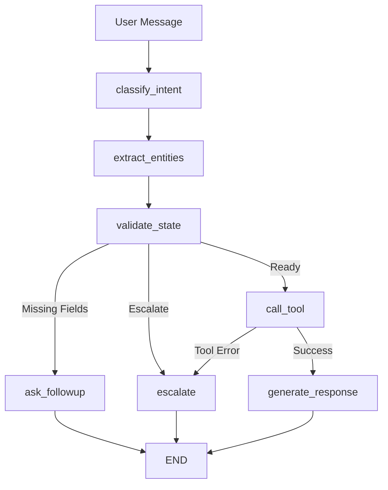

# SecureBank Support Agent

An agentic customer support workflow for banking, built using **LangGraph.js** and **TypeScript**.

---

## Overview

The SecureBank Support Agent is designed to handle common banking support requests through a stateful, multi-turn conversational workflow.

### Supported Intents

The agent currently supports three banking operations:

1. **Balance Inquiry**

   * Retrieves account balance information.

2. **Block Card**

   * Blocks a debit or credit card using the card's last four digits.

3. **Dispute Transaction**

   * Retrieves information about a disputed transaction.

Any request outside these supported intents is automatically escalated to a human support representative.

---

# Architecture Overview

The application is implemented as a **stateful LangGraph workflow**.

Each user message passes through a series of graph nodes. State is maintained across conversation turns, allowing the agent to collect missing information and complete requests over multiple interactions.

### Design Principles

* Each node performs a single responsibility.
* The LLM is used only for:

  * Intent classification
  * Entity extraction
  * Response generation
* Routing decisions are handled through deterministic application logic.
* Backend operations are executed through structured tools.

---

# Workflow

```text
[User Message]
      ↓
  [classify]
      ↓
  [extract]
      ↓
  [validate]
      ↓
  ┌───────────────┴───────────────┐
  │                               │
Missing Fields?             Escalation Needed?
  │                               │
  ↓                               ↓
[ask_followup]              [escalate]
  │                               │
  └─────── Next Turn ─────────────┘

            ↓
       [call_tool]
            ↓
      Tool Error?
       │       │
       ↓       ↓
 [escalate] [respond]
```

---

## Graph Flow



---

# Prompting Strategy

All prompts are stored in the `src/prompts/` directory and injected into graph nodes during execution.

| Prompt File     | Purpose                                             |
| --------------- | --------------------------------------------------- |
| `system.ts`     | Defines agent persona, scope, and operating rules   |
| `intent.ts`     | Classifies incoming requests into supported intents |
| `extraction.ts` | Extracts structured entities from user input        |
| `response.ts`   | Generates customer-facing responses                 |
| `escalation.ts` | Handles human handoff messaging                     |

### Hallucination Mitigation

The prompting strategy is designed to minimize hallucinations:

* **Intent Classification**

  * Uses strict labels and few-shot examples.
  * Prevents creation of unsupported intents.

* **Entity Extraction**

  * Uses explicit extraction rules.
  * Rejects vague references such as "my card".

* **Response Generation**

  * Grounded entirely in tool output.
  * Prevents fabrication of banking data.

### Model Configuration

| Node Type           | Temperature |
| ------------------- | ----------- |
| Classification      | 0.0         |
| Extraction          | 0.0         |
| Response Generation | 0.3         |

---

# Tool Design

All backend integrations are mocked using in-memory data structures.

Each tool exposes a clearly defined input/output contract.

| Tool                    | Input            | Output                                 |
| ----------------------- | ---------------- | -------------------------------------- |
| `getAccountDetails`     | `account_number` | `name`, `balance`, `status`            |
| `getTransactionDetails` | `transaction_id` | `merchant`, `amount`, `date`, `status` |
| `blockCard`             | `last4`          | `success`, `reference_id`, `message`   |

### Error Handling

All tools return either:

```typescript
{
  // successful response
}
```

or

```typescript
{
  error: string;
}
```

---

# State Management

Application state is implemented using LangGraph `Annotation` and is passed through every node in the workflow.

### State Fields

| Field               | Description                  |
| ------------------- | ---------------------------- |
| `intent`            | Classified user intent       |
| `entities`          | Extracted structured data    |
| `missing_fields`    | Information still required   |
| `tool_results`      | Raw backend response         |
| `confidence`        | Intent confidence (high/low) |
| `escalation_reason` | Reason for escalation        |
| `final_outcome`     | Resolved or escalated        |

---

# Setup Instructions

## 1. Clone Repository

```bash
git clone <your-repository-url>
cd banking-agent
```

## 2. Install Dependencies

```bash
npm install
```

## 3. Configure Environment Variables

```bash
cp .env.example .env
```

Add your API key:

```env
GROQ_API_KEY=<your_api_key>
```

## 4. Run the Application

```bash
npm run dev
```

---

# Known Limitations

* No persistent memory across sessions.
* Dispute workflow retrieves transaction details but does not create dispute tickets.
* Entity extraction relies on LLM output and may occasionally misidentify values.
* No authentication or authorization layer is implemented.
* Account numbers are trusted as provided.

---

n
* Compliance-focused escalation workflows
